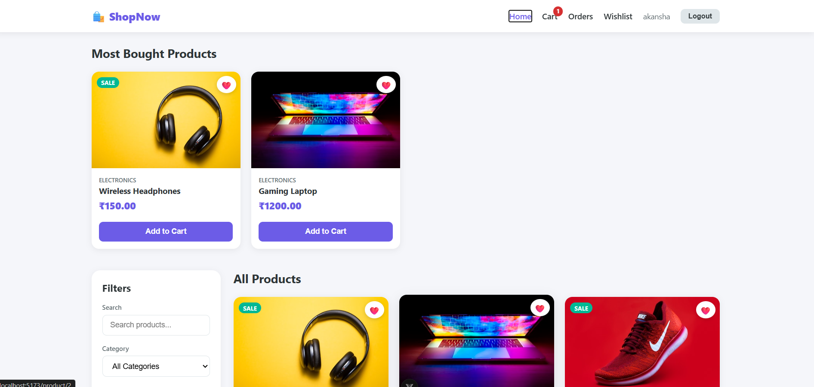
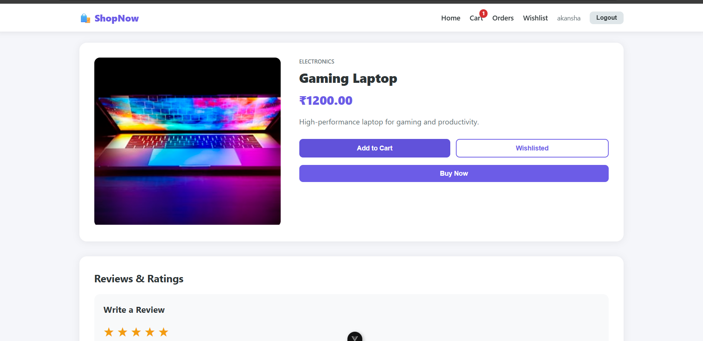
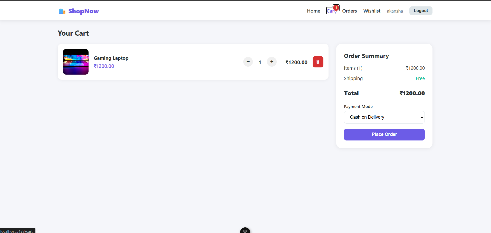
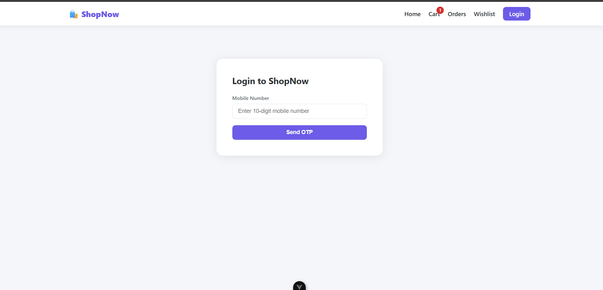
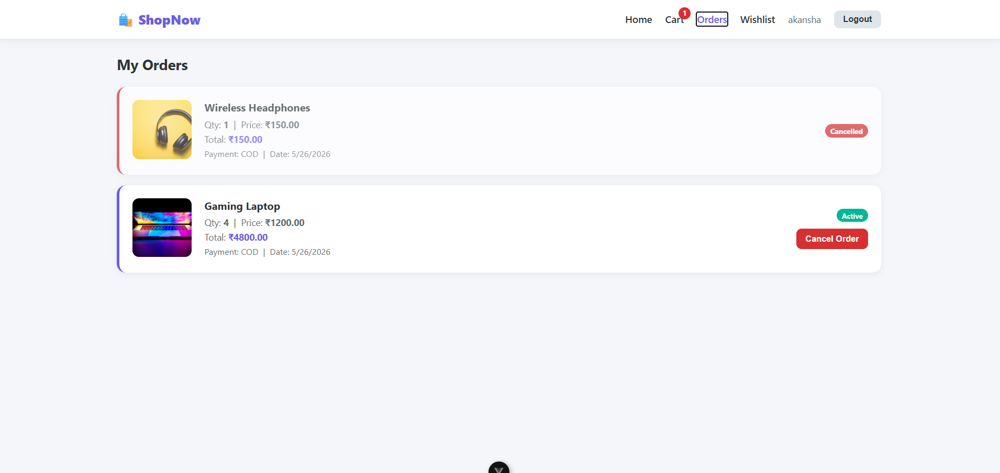
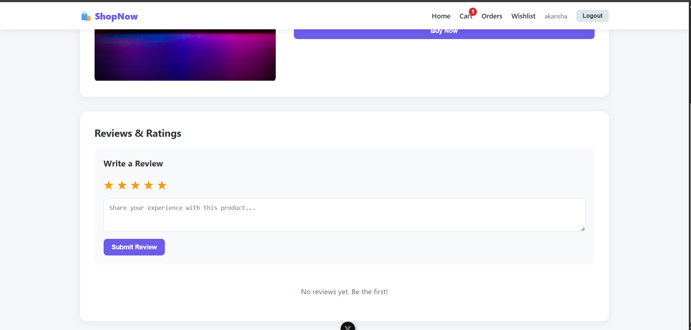
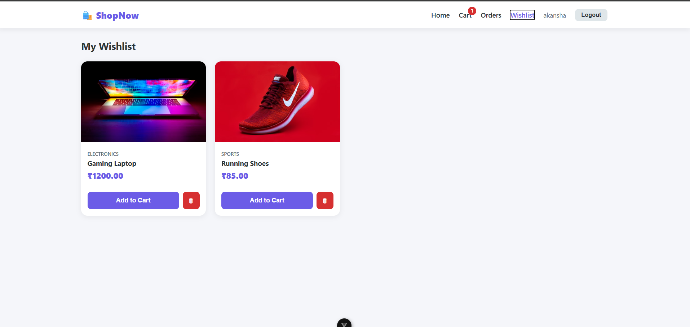

<<<<<<< HEAD
# ShopNow — E-commerce Fullstack App

A fullstack e-commerce web application built with Django REST Framework (backend) and Vue.js 3 + Vuex (frontend).

---

## Tech Stack

| Layer    | Technology |
|----------|-----------|
| Backend  | Django 5, Django REST Framework |
| Database | PostgreSQL |
| Frontend | Vue.js 3, Vuex, Vue Router |
| HTTP     | Axios |
| Hosting  | Railway (backend), Vercel (frontend) |

---

## Features

- OTP-based mobile login
- Product listing with grid layout
- Category, price range, and sale filters
- Search with debounce
- Shopping cart (add, remove, update quantity)
- Order placement and cancellation
- Wishlist (save products for later)
- Product reviews and star ratings
- Most bought products section
- Fully responsive UI

---

## Project Setup

### Backend

```bash
cd backend
python -m venv venv
venv\Scripts\activate       # Windows
pip install -r requirements.txt
cp .env.example .env        # fill in your values
python manage.py migrate
python manage.py runserver
```

### Frontend

```bash
cd frontend
npm install
npm run dev
```

---

## Environment Variables

Create `backend/.env`:
---

## API Endpoints

| Method | Endpoint | Description |
|--------|----------|-------------|
| POST | /api/auth/send-otp/ | Send OTP |
| POST | /api/auth/verify-otp/ | Verify OTP and login |
| GET | /api/products/ | List all products |
| GET | /api/products/?category=X | Filter by category |
| GET | /api/products/?search=X | Search products |
| GET | /api/products/?min_price=X&max_price=Y | Filter by price |
| GET | /api/products/most-bought/ | Top purchased products |
| GET | /api/products/:id/ | Product detail |
| POST | /api/cart/add/ | Add to cart |
| GET | /api/cart/:user_id/ | View cart |
| PATCH | /api/cart/update/:id/ | Update quantity |
| DELETE | /api/cart/remove/:id/ | Remove from cart |
| POST | /api/orders/create/ | Place order |
| GET | /api/orders/:user_id/ | List orders |
| PATCH | /api/orders/cancel/:id/ | Cancel order |
| GET | /api/wishlist/:user_id/ | View wishlist |
| POST | /api/wishlist/add/ | Add to wishlist |
| DELETE | /api/wishlist/remove/:id/ | Remove from wishlist |
| GET | /api/reviews/:product_id/ | Get reviews |
| POST | /api/reviews/create/ | Submit review |
| GET | /api/reviews/rating/:product_id/ | Get avg rating |

---

## UI Screenshots
### Home Page

### Product Page


### Cart Page

### login page

### orders 

### reviews & ratings 

### wishlist 

=======
# shop-now---ecommerce-project
ShopNow is a modern fullstack e-commerce web application built with Django REST Framework and Vue.js 3. The project demonstrates complete frontend and backend integration including product management, cart functionality, order processing, authentication, filtering, debounced search, and real-time cart updates.
>>>>>>> f6fd6f59b90e490e8229297fb98405538f75401f
